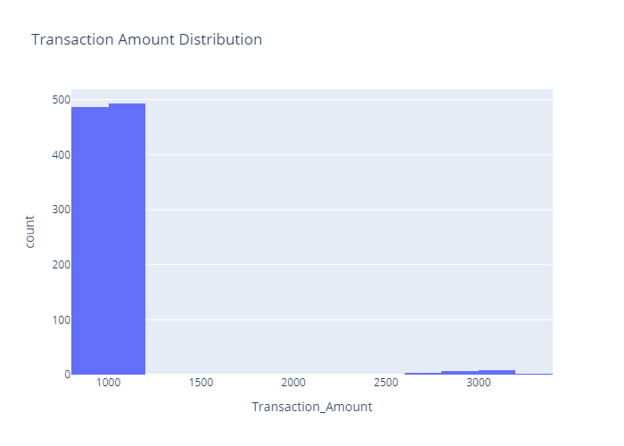
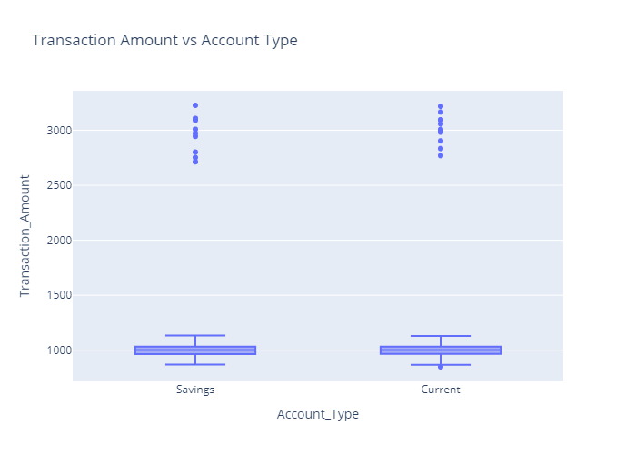

# Anomaly Detection in Transactions

## Overview
This project focuses on detecting anomalies in transaction data to identify potential fraudulent activities. The dataset consists of various transactional attributes such as `Transaction_Amount`, `Account_Type`, `Age`, and many more. By utilizing machine learning techniques like **Isolation Forest** and **Local Outlier Factor (LOF)**, I tried to classify transactions as either normal or anomalous. Additionally, I performed Exploratory Data Analysis (EDA) to gain insights into customer behavior, spending patterns, and potential anomalies.

## EDA (Exploratory Data Analysis)
### Transaction Amount Distribution: To identify the normal spending range and potential outliers

### Transaction Amount vs Account Type: To compare transaction amounts across `Savings` and `Current` accounts.

### Average Transaction Amount by Age: To analyze the relationship between `Age` and `Average_Transaction_Amount`.

### Number of Transactions by Day of the Week: To analyze the transaction patterns across days of the week.

### Correlation Heatmap: To understand the relationships between numeric features in the dataset.

### Customer Segmentation by Age and Income: To segment customers based on `Age` and `Income`.

### Gender and Transaction Amount: To analyze transaction behavior across gender.

## Machine Learning Models

## Conclusion

## References

